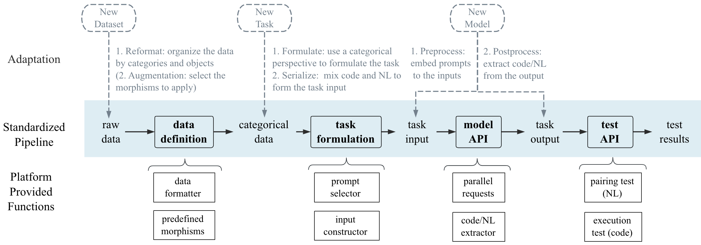

## CatCode: A Comprehensive Evaluation Framework for LLMs On the Mixture of Code and Text

This repository is the official implementation of [CatCode: A Comprehensive Evaluation Framework for LLMs On the Mixture of Code and Text](https://openreview.net/forum?id=O20aKqSrVe). 

  

This repo has contained the complete evaluation process on the following aspects:

- [x] identify morphisms
- [x] apply functors between two code categories
- [x] apply functors between code and natural language

## Platform Pipeline

Using categorical perspective to formulate different tasks,  share a standard pipeline as the Figure 2:



​															(Figure 2)

In this repository, we have the following data and code directories:

- `./data`: data of different stages, including subfolders:
  - "raw_data": direct copy of existing datasets
  - "categorical_data": data rearranged by the categorical task definition
  - "task_input": input data for specific model on specific task
  - "task_output": output data by specific model on specific task
  - "test_results": evaluation results
- `./scripts`: the processing of data, containing the bash scripts to reproduce the main results
- `./plugins`: contains two third-party plugins("JavaTransformer" used for applying morphisms, and "mbxp-exec-eval" for execution-based evaluation, We've made *some modifications* for evaluation needs)
- `./src`: code arranged according to the stages they're used, with a `utils` folder of reusable functions

## Requirements

To install requirements:

```setup
pip install -r requirements.txt
```

## Data Definition (data preprocess)

Run the following scripts:

```sh
run_download_dataset.sh  (step1)
run_data_formatter.sh    (step2)
run_data_morphism.sh     (step3)
```

- Note: Plugin `JavaTransformer` is needed in `step3`, make sure you've installed java (suggested version: openjdk 1.8.0_222, javaparser 3.24.4). For more details about JavaTransformer, please refer to: https://github.com/mdrafiqulrabin/JavaTransformer.

## Task formulation

Run the following script:

```sh
run_input_consturctor.sh
```

## Model API

Run the following script:

```sh
run_model_api.sh
```

- Note: to call model apis, certain api_keys are needed. You can enter your keys in `config/config.json`.
- supported: ChatGPT and other OpenAI models that can be accessed by API; CodeGeeX

## Test API (evaluation)

Run the following scripts:

```sh
run_test_api.sh
```

## Results

- morphism identification

   

- translation functor

    

- reproduction functor

   

